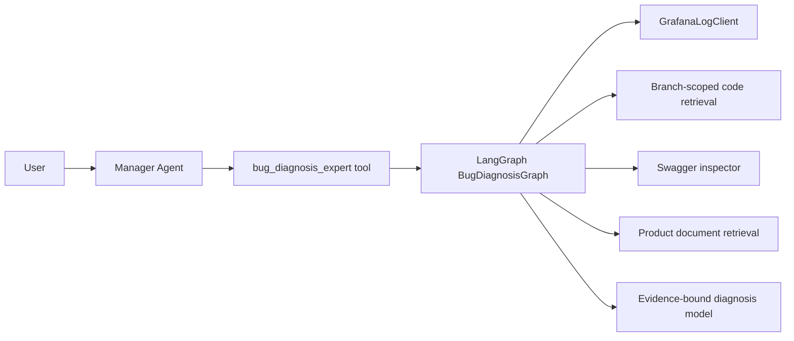
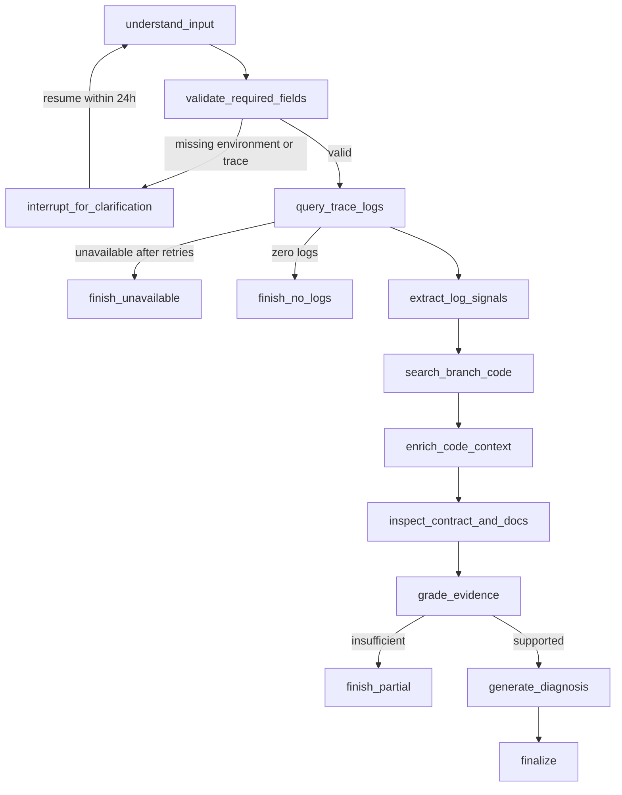

# LangGraph Bug Diagnosis And Citation Detail Design

## Goal

Upgrade the current Bug specialist from model-directed tool planning to a
LangGraph workflow that can understand conversational Bug reports, pause for
required information, query Grafana logs, correlate evidence with the correct
code branch, and produce an evidence-graded diagnosis.

This change also makes citation details useful in the Vue client by loading a
bounded source excerpt on demand. Metric MCP orchestration is explicitly out of
scope for this iteration.

## Scope

### Included

- Replace the current free-planning `bug_diagnosis_expert` implementation with
  a graph-backed Manager tool.
- Use an LLM intake node to normalize conversational Chinese Bug descriptions.
- Require a verified environment and trace ID before diagnosis continues.
- Persist an interrupt for missing required fields and resume it within 24
  hours using the same conversation ID.
- Query the existing fixed-scope Grafana client, extract diagnostic signals,
  retrieve branch-scoped code, and optionally inspect relevant Swagger and
  product documentation.
- Apply deterministic evidence rules before generating a diagnosis.
- Add a read-only citation detail endpoint and enhance the Vue citation panel.

### Excluded

- Changes to metric MCP tool ordering or metric query orchestration.
- Migration of the Manager, metric, approval, or workflow specialists to
  LangGraph.
- Bug diagnosis without both an environment and trace ID.
- Raw log display in API citations or the Vue citation panel.
- Real business API execution, database querying, or code modification tools.

## Architecture

The OpenAI Agents SDK Manager remains the top-level conversational agent. Its
public tool name remains `bug_diagnosis_expert`, but the tool invokes
`BugDiagnosisGraphService` instead of running a nested free-planning Agent.



The graph uses a dedicated SQLite checkpoint database at
`storage/bug_graph.db`. The LangGraph thread ID is the application
`conversation_id`, which lets a later chat turn resume a pending clarification.
Only one active Bug diagnosis is allowed per conversation. Starting a different
Bug while a clarification is pending is treated as additional information for
the pending diagnosis. The user can send `取消诊断` to delete that checkpoint
and start a separate Bug diagnosis.

## Dependencies And Configuration

Add `langgraph==1.2.9` and `langgraph-checkpoint-sqlite==3.1.0`. These versions
support Python 3.10+ and are compatible with the currently installed
`langchain-core==1.4.9`, Pydantic 2, and `aiosqlite` baseline.

New configuration:

- `BUG_GRAPH_ENABLED=true`
- `BUG_GRAPH_DB=storage/bug_graph.db`
- `BUG_GRAPH_INTERRUPT_TTL_SECONDS=86400`
- `BUG_GRAPH_LOG_RETRY_COUNT=2`
- `BUG_GRAPH_LOG_RANGE_MINUTES=1440`
- `BUG_GRAPH_MIN_RERANK_SCORE=0.35`
- `CITATION_DETAIL_MAX_CHARS=6000`
- `BUG_GRAPH_CODE_TOP_K=5`

All paths resolve relative to the project root. Invalid retry counts, TTLs, or
excerpt limits fail Settings validation.

## Graph State

`BugDiagnosisState` is a typed state containing only checkpoint-safe values:

- conversation ID and run ID;
- original user message and normalized problem statement;
- environment candidate, environment evidence, and confidence;
- verified trace ID and source span;
- optional service, endpoint, symptom, occurrence time, and domain hints;
- missing fields and clarification question;
- graph status and current stage;
- log count, exception types, stack-frame identifiers, and truncation status;
- code chunk IDs, matched symbols, branches, paths, and line ranges;
- Swagger operation identities and document chunk IDs;
- citation records, evidence grade, warnings, and terminal reason;
- created, updated, interrupted, and expires-at timestamps.

The state never stores Grafana credentials, URLs, datasource IDs, namespaces,
raw log lines, complete code/document content, prompts, model responses, or
embeddings. HTTP clients, model clients, repositories, and inspectors are
provided through non-serialized runtime dependencies.

Raw but sanitized evidence is held only in an in-memory per-run evidence store.
Because the only human interrupt occurs before external evidence collection,
no evidence body needs to survive a pause. If the process fails after querying
begins, the graph restarts from the appropriate query node and reconstructs its
ephemeral evidence from source systems.

## Input Understanding

The first node uses the configured Agent model provider to create a structured
`BugIntake`:

- normalized problem statement;
- environment candidate and quoted evidence from the user message;
- trace ID candidate and its source span;
- service, endpoint, symptom, occurrence time, and domain hints;
- missing fields, confidence, and a clarification question.

A deterministic validator then enforces trust boundaries:

- the trace ID must exactly occur in the user message and match the existing
  6-200 character allowlist;
- environment aliases map only as follows: development phrases to `develop`,
  test phrases to `test`, and online/production phrases to `prod`;
- ambiguous environment language is treated as missing regardless of model
  confidence;
- branch is never accepted from model output or client input;
- a model-created trace ID that cannot be found in the original text is
  discarded.

## Nodes And Transitions



### `understand_input`

Runs the LLM intake parser. On resume, it combines the original report with the
new user message while retaining the original text for provenance checks.

### `validate_required_fields`

Validates environment and trace ID. Missing or ambiguous values transition to
an interrupt. The clarification is exempt from the general zero-citation
evidence gate because it is a request for input, not an internal factual answer.

### `query_trace_logs`

Uses the existing fixed server-owned mappings:

| User environment | Loki target | Code branch |
| --- | --- | --- |
| develop | develop | develop |
| test | test | develop |
| prod | prod | master |

Transient transport and 5xx failures are retried at most twice with bounded
backoff. Authentication, validation, and other permanent errors are not
retried. Identical trace/environment queries are executed once per graph run.

### `extract_log_signals`

Uses the deterministic sanitized parser to extract exception types, Java stack
frames, service/logger names, and HTTP method/path candidates. The model may
rank or summarize extracted signals but cannot introduce an unobserved symbol.

### `search_branch_code`

Requires at least one positive log entry. It first performs exact symbol/path
lookup using exception and stack-frame identifiers, then uses the existing
BM25 + Vector + RRF + Rerank pipeline for unresolved signals. The branch is
server-owned. Low-relevance nearest-neighbor results are not accepted as
evidence.

### `enrich_code_context`

Loads the containing class, imports, interface implementations, and direct
symbol context for accepted code chunks. It records only public source
identifiers and line ranges in graph state.

### `inspect_contract_and_docs`

Runs only when evidence contains an HTTP operation or a domain can be resolved
from accepted code metadata. Swagger inspection uses registered source IDs;
product document lookup remains domain-scoped. Failure is non-fatal and is
recorded as a warning.

### `grade_evidence`

Evidence levels are deterministic:

- `none`: no positive logs;
- `log_only`: positive logs but no relevant code;
- `correlated`: log stack/exception evidence aligns with an accepted code
  symbol, path, or line range;
- `contract_supported`: correlated evidence is also supported by Swagger or a
  product document.

Only `correlated` and `contract_supported` may state a likely code root cause.
`log_only` may report observed failures and next investigation steps but may
not name a code root cause.

### `generate_diagnosis`

This is the second and final LLM node. It receives only bounded sanitized
evidence and must produce Chinese sections for:

1. problem summary;
2. confirmed log evidence;
3. code location;
4. likely cause and confidence;
5. alternative causes;
6. repair options;
7. verification steps;
8. missing information.

The final response remains a string for provider compatibility. Citation and
evidence-grade records are constructed by code rather than parsed from model
text.

## Interrupt And Resume

When required input is missing, the graph calls LangGraph `interrupt()` with a
serializable payload containing only missing field names and the clarification
question. The graph tool marks the Agent context as
`clarification_required`, so `AgentService` does not replace that response with
the evidence-unavailable message.

On the next turn, the Manager calls the same Bug tool. The graph service checks
for a pending checkpoint using `conversation_id` and resumes it with the new
message. A pending checkpoint expires after 24 hours. Expired checkpoints are
deleted and the next Bug request starts a new graph.

## Public API Compatibility

The existing chat JSON and SSE endpoints remain unchanged. A completed Bug run
returns the existing `AgentResponse` shape. Clarification remains a normal
assistant answer; no new approval status is introduced.

Graph stages are recorded as sanitized tool audit entries. They do not include
raw node input/output. Dedicated graph-stage SSE events are excluded from this
implementation; existing Agent/tool events remain the public streaming contract.

## Citation Detail API

Add a read-only endpoint:

```text
GET /api/v1/citations/detail?source_type=<type>&source_id=<id>
```

Response:

```json
{
  "source_type": "code",
  "source_id": "chunk-id",
  "title": "ApprovalService.transfer",
  "domain": "approval-flow",
  "excerpt": "bounded source excerpt",
  "language": "java",
  "truncated": false,
  "metadata": {}
}
```

The endpoint resolves only citation types and IDs already registered in the
local Chroma/catalog/Swagger data. It does not accept arbitrary paths, URLs,
collection names, branches, or source locations.

Detail behavior:

- `code`: return the accepted chunk around its recorded line range, at most
  6,000 characters, plus branch, commit, path, symbol, line range, and GitLab
  permalink;
- `product_document` and `knowledge_chunk`: return the matching section, plus
  file, heading, page, and version metadata;
- `swagger`: return the registered operation summary, parameters, schemas, and
  response codes from the last successful specification cache;
- `log_trace`: do not call the detail endpoint; use only the public metadata
  already present in the chat citation;
- `mcp_tool`: do not call the detail endpoint; use only the public tool identity
  and audit metadata already present in the chat citation.

Unknown, disabled, or deleted sources return `404`. A stale Swagger cache is
marked explicitly. Credentials, raw logs, full MCP output, embeddings, and
unbounded source bodies are never returned.

## Vue Citation Panel

`CitationPanel` loads detail only after the user selects a citation. It has
loading, loaded, empty, and error states. Switching citations cancels or
ignores the previous request.

The panel displays:

- source type, domain, title, and source identity;
- typed metadata appropriate to code, document, Swagger, log, or MCP;
- a scrollable `命中内容` section for source excerpts;
- copy excerpt/code and open GitLab/source actions when applicable;
- truncation and stale-cache notices.

Desktop and mobile use the same component. Excerpts wrap safely, code uses a
scrollable monospace block, and the panel remains independently scrollable.

## Error Handling

- Missing environment or trace ID: interrupt and request the exact missing
  fields.
- Invalid or model-invented trace ID: discard and interrupt.
- Grafana unavailable after retry: finish with a capability-unavailable result.
- Zero logs: stop before code retrieval and ask the user to verify trace,
  environment, and time range.
- No relevant code: return a `log_only` partial diagnosis without a code root
  cause.
- Swagger/document failure: continue with correlated log/code evidence and a
  warning.
- Diagnosis model failure: return the deterministic evidence summary and
  suggested manual checks.
- Expired interrupt: delete checkpoint and start a new intake.
- Citation detail unavailable: return `404`; the Vue panel shows a non-blocking
  unavailable state.

## Privacy And Persistence

- Grafana URL, bearer token, datasource UID, namespace, GitLab credentials,
  Swagger credentials, API keys, raw logs, complete source bodies, prompts,
  full model responses, and embeddings never enter graph checkpoints, Agent
  context, public tool audits, logs, or citation metadata.
- Sanitized user messages may be stored in the graph checkpoint because they
  are required for pause/resume provenance checks.
- Citation detail content is returned only by the on-demand API and is not
  added to chat history or remote tracing.
- Existing `trace_include_sensitive_data=False` behavior remains mandatory.

## Testing

### Graph Unit Tests

- conversational Chinese intake and environment alias mapping;
- trace candidate provenance and invented-trace rejection;
- interrupt, resume, same-conversation isolation, and 24-hour expiry;
- Grafana transient retry and permanent-error no-retry behavior;
- zero-log terminal path;
- develop/test/master branch mapping;
- exact symbol lookup before hybrid retrieval;
- low-relevance code rejection;
- evidence grading and final-report constraints;
- checkpoint serialization excludes evidence bodies and credentials.

### Integration Tests

- fake Grafana + fake retrieval + fake model successful diagnosis;
- log-only partial diagnosis;
- optional Swagger/document enrichment failure;
- Manager routes Bug questions into the graph-backed tool;
- clarification bypasses the zero-citation gate while factual unsupported
  output remains gated;
- JSON and SSE API regression.

### Citation Detail Tests

- typed detail lookup for code, document, Swagger, log, and MCP citations;
- 6,000-character cap, truncation marker, and metadata allowlist;
- unknown/deleted source `404`;
- no raw logs, credentials, embeddings, or MCP output;
- Vue loading/error/content states, copy action, permalink, desktop layout, and
  mobile drawer layout.

### Verification

- run all existing backend tests and new LangGraph tests;
- run Vue unit tests and production build;
- run Playwright desktop/mobile citation-panel checks;
- run a fake end-to-end Bug diagnosis;
- run an opt-in live Grafana trace diagnosis only when an explicit test trace
  ID is supplied.

## Acceptance Criteria

- A vague but sufficient user report is normalized into a verified environment
  and trace ID without inventing either value.
- Missing required information pauses and resumes from the same conversation
  within 24 hours.
- Logs are queried before code, zero logs never trigger code retrieval, and
  the branch is fixed by environment.
- The diagnosis distinguishes confirmed facts, likely causes, alternatives,
  and unknowns using deterministic evidence grades.
- The Manager and non-Bug specialists keep their existing behavior; metric MCP
  orchestration is unchanged.
- Selecting a citation displays a bounded useful excerpt and typed metadata,
  while raw logs and sensitive tool output remain hidden.
- Existing and new automated tests pass, and the single-process service starts
  with LangGraph and citation detail readiness available.
